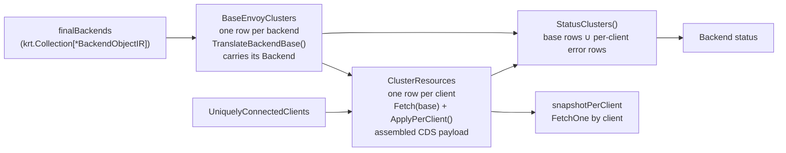

# EP-14184: Shared Base Clusters with Per-Client Overlays

- Issue: [#14184](https://github.com/kgateway-dev/kgateway/issues/14184)
- Originating PR: [#14343](https://github.com/kgateway-dev/kgateway/pull/14343) (superseded by the 7-PR stack in [Delivery](#delivery))
- Predecessors: [#14104](https://github.com/kgateway-dev/kgateway/pull/14104), [#14317](https://github.com/kgateway-dev/kgateway/pull/14317)
- Related: [#13586](https://github.com/kgateway-dev/kgateway/issues/13586) (the *backends* axis of the same scaling problem)

## Background

kgateway serves a distinct xDS snapshot to every *uniquely connected client* (UCC). A UCC is
a bucket of Envoy streams that share a role, namespace, locality, augmented pod labels, and
local-cluster capability — the inputs that can legitimately change what config a proxy should
receive. Any Envoy whose locality or labels differ gets its own UCC.

Before this EP, the cluster half of that per-client pipeline forked the **entire** backend
translation for every `(backend, client)` pair:

```go
// pkg/kgateway/proxy_syncer/backends.go, before
for _, ucc := range krt.Fetch(kctx, uccs) {
    c, err := translator.TranslateBackend(ctx, kctx, ucc, backendObj) // full translation
    ...                                                              // one KRT row per pair
}
```

`TranslateBackend` builds the cluster from scratch: `initializeCluster`, the backend plugin's
`InitEnvoyBackend`, DNS lookup family, every `ProcessBackend` policy hook, the Gateway backend
client certificate, and — in strict mode — a full Envoy bootstrap validation. Almost none of
that depends on the client. The parts that genuinely do are small and rare:

- a destination rule whose `workloadSelector` matches this proxy's labels (outlier detection,
  locality LB, TCP keepalive);
- the ambient waypoint ingress redirect, which rewrites an EDS cluster into a STATIC one; and
- an inline `ClusterLoadAssignment`, whose endpoint priorities are computed from the client's
  locality by `PrioritizeEndpoints`.

With `N` connected client shapes and `M` backends, the control plane therefore performed
`O(N*M)` full translations and retained `O(N*M)` KRT rows, each holding an independently
allocated `Cluster` proto, and recomputed all of it whenever a client connected or
disconnected. #14184 is the incident that made this visible: a fleet with 15 UCCs multiplied
every backend's translation by 15, and the resulting CPU and GC pressure interacted badly with
the per-client readiness gates that were later reverted in #14380.

`gatewayScopedBackend` (the Gateway-backend-client-certificate variant collection) shows what
the right shape looks like: a rare, structurally-required fork expressed as a *separate row*
rather than as a multiplier on every row. This EP applies the same idea to per-client
translation.

## Motivation

Per-client cluster state is the dominant term in kgateway's control-plane footprint on large
clusters, and it grows in the one dimension operators cannot control: how many distinct Envoy
shapes are connected. Two operational consequences follow.

**Cost.** Translation cost and retained memory both scale with `N*M` even though the
per-client *difference* is usually empty. Duplicate `Cluster` protos dominate the KRT store,
and each is re-marshalled for hashing on every recompute.

**Blast radius.** Because every `(client, backend)` pair is one row in one flat collection,
one client's churn invalidates the whole collection, and any consumer that waits for
coherence waits on the whole fleet. That coupling is the structural reason the #13868
readiness gates could deadlock (#14184, #14352): a barrier expressed over a fleet-wide
collection cannot distinguish "this client is not ready" from "some other client is not
ready".

## Goals

- Translate each backend's client-invariant cluster **once**, and share the resulting proto
  read-only across every client that targets it.
- Store per-client cluster state **sparsely**: a client allocates a cluster proto only for the
  backends whose cluster genuinely differs for it, so retained state is `O(M) + O(N*K)` with
  `K << M` in typical workloads.
- Keep one client's CDS **independent** of every other client: a connect, disconnect, or
  shape change reruns that client's work and nobody else's, and there is no cross-collection
  state to reconcile before publishing.
- Make the new aliasing **enforceable**: a mutation of a shared proto must fail loudly in CI
  rather than silently corrupt sibling clients' snapshots.
- Give endpoint plugins a mutation surface that cannot reach KRT-owned or cross-client state.
- Preserve observable xDS output and Backend status for every existing configuration.

## Non-Goals

- Reducing the *set* of backends discovered. Scoping CDS/EDS to route-referenced Services is
  the separate backends axis tracked in #13586.
- Reintroducing per-client readiness gates. The first-connect grace period from #14380 remains
  the mechanism that hides the convergence window from a client's first watch.
- Changing UCC bucketing, `DISABLE_POD_LOCALITY_XDS`, or the local-cluster EDS resource.

## Implementation Details

### Overview



### Translator and Proxy Syncer

`BackendTranslator.TranslateBackend` is replaced by two functions with an explicit ownership
contract (`pkg/kgateway/translator/irtranslator/backend.go`).

**`TranslateBackendBase(ctx, backend) *BaseCluster`** performs every UCC-invariant step and
returns a proto that is shared read-only across all clients. `BaseCluster` also carries the
non-proto state the per-client phase needs:

| Field | Purpose |
| --- | --- |
| `Cluster` | the shared cluster proto |
| `EndpointInputs` | inline endpoints from `InitEnvoyBackend`, if any |
| `SupportsInlineCLA` | cluster type accepts an inline CLA (STATIC / STRICT_DNS / LOGICAL_DNS / `envoy.clusters.dns`) |
| `DefaultedLocalityConfig` | `defaultLocalityConfig` — not a policy — chose the locality mode |
| `Error` | translation failed; `Cluster` is the blackhole |

`NeedsInlineCLA()` is the derived predicate that ties the two phases together: it is true when
the cluster type takes an inline CLA, the backend produced inline endpoints, and no plugin
already set a `LoadAssignment`. Such a base is **deliberately not validated and never
publishable on its own** — Envoy rejects some CLA-less clusters outright (logical-DNS requires
exactly one endpoint), so validating the base would blackhole a valid ServiceEntry for every
client.

**Most inline CLAs do not depend on the client, and those are built on the base.**
`PrioritizeEndpoints` reads the client (labels, locality) only through a resolved
`PriorityInfo`: one set by an endpoint hook, or one implied by a zone- or node-preferring
traffic distribution (`endpoints.DependsOnClient` is the single source of truth for this).
When neither applies, and no contributed endpoint hook could edit the backend's endpoints,
`TranslateBackendBase` builds the CLA itself, so the base is complete, validated once, and
`NeedsInlineCLA()` is false. Whether a hook *could* apply is the plugin's call:
`sdk.PolicyPlugin.PerClientEndpointsMayApply(backend)` returns false to rule a backend out
(`BackendConfigPolicy` uses `sdk.AttachedPolicyEndpointsMayApply`, since its hook reads only
attached policies); a hook that declares nothing is assumed to apply everywhere, so an
out-of-tree plugin keeps the per-client build until it opts in. `DestinationRule` declares
nothing on purpose — which rule applies is selected by the client's namespace and labels — so
with Istio integration on, inline-CLA backends stay per-client. The dominant plain static or
DNS backend therefore costs the same as an EDS backend: one shared proto, no per-client work.

**`ApplyPerClient(kctx, ctx, ucc, backend, base) (*Cluster, error)`** returns `nil, nil` — the
dominant case — when the pair needs no per-client cluster. Otherwise it clones the base and
applies, in order:

1. every applicable `ClusterOverlay`, sorted by `GroupKind` so the mutated proto is
   byte-stable across recomputes (`ContributedPolicies` is a map);
2. `undoDefaultedLocalityConfig`, if the base defaulted the locality mode and an overlay has
   since replaced the EDS cluster with a plugin-provided inline one (the waypoint redirect
   does exactly this — see [Ordering changes](#ordering-and-semantic-changes));
3. the inline CLA, built through `ResolveEndpointInputs` + `PrioritizeEndpoints`, only if the
   base needs one and no overlay supplied one; and
4. strict-mode validation of the **complete** per-client cluster. Overlay output was never
   validated before this EP.

On validation failure it returns `(blackhole, err)`, so a per-client failure has the same
shape as a base failure and the snapshot consumer's errored-cluster tracking is unchanged.

### Per-client CDS storage

`PerClientEnvoyClusters` (`pkg/kgateway/proxy_syncer/backends.go`) becomes two collections
instead of one flat per-pair collection:

- **`base`** — `krt.Collection[baseEnvoyCluster]`, keyed by cluster name, one row per backend.
  The row carries the shared proto behind a `sharedproto.Shared`, its content version, and the
  `BackendObjectIR` it was translated from.
- **`perClient`** — `krt.Collection[clustersWithErrors]`, keyed by client, one row per connected
  client: that client's assembled CDS payload. The transform fetches every base row and calls
  `ApplyPerClient` for each; where it returns `nil` (the dominant case) the shared proto is
  published as-is, and where it returns a cluster the client owns that clone. Errored bases and
  per-client failures are excluded from the payload and tracked by name.

The per-client transform is the **only writer of per-client cluster state, and it reads only
immutable base rows plus whatever the client's overlays fetch**. That is the whole design:
there is no second collection holding per-client results, so there is no cross-collection
generation to fence, no ambiguity between "no overlay applies" and "not evaluated yet", and no
way for one client's transform to observe another client's state at all. A client's row is
complete by construction the first time it exists. In particular:

- a newly connected client can never see an un-overlaid base or a CLA-less inline cluster,
  because its own transform runs the overlays and builds the inline CLA before returning;
- a client connecting, disconnecting, or changing shape (`KnowsLocalCluster`, labels) reruns
  exactly one transform — its own — and no other client's;
- a base change reruns every client's transform once, each an `O(M)` walk whose per-backend
  cost on the no-overlay path is a few function calls and no allocation. Inline-CLA backends
  are on that path too unless their CLA genuinely depends on the client (see
  `NeedsInlineCLA` above), so the walk allocates only for overlaid pairs and client-ordered
  CLAs.

**Backend metadata reaches clients through equality, not through a second input.** An overlay
may branch on the backing object's labels (the waypoint redirect does), so a metadata-only
Service change must rebuild every client's payload even when the shared proto is byte-identical.
`baseEnvoyCluster` therefore carries `OverlayInputsHash`, the fold of every overlay plugin's
declaration of what it reads from the backend, and compares that rather than the `Backend`
itself. The row keeps the `Backend` for the overlays to read, marked `+noKrtEquals`: when
`Equals` returns true KRT keeps the old row, so the overlays are handed the backend of the last
row that differed, which is correct precisely because every field they read is in the hash.

Comparing the declaration rather than the object is what makes the row able to distinguish a
write that matters from one that does not. A status update, an annotation, or a label no
overlay branches on moves neither the hash nor the proto, so the write stops at the base
re-translation instead of rerunning every client's `O(M)` walk. A plugin that declares nothing
is assumed to read the whole object, which costs that walk but is never stale.

`baseClusterVersion` folds the inline endpoints hash **and** the attached-policy hash into the
base proto hash when `SupportsInlineCLA` is true. The per-client CLA is built from
`BaseCluster.EndpointInputs`, which is not part of the base proto; KRT keeps the *old* stored
object when `Equals` returns true, so without this fold an endpoint or policy change would
leave clients pinned to a stale `LoadAssignment` forever. It mirrors what
`newFinalBackendEndpoints` already does for the EDS path. It is gated on `SupportsInlineCLA`
so EDS clusters — whose endpoints flow through the separate EDS pipeline — do not churn.

The base transform checks that translation named the cluster after
`BackendObjectIR.ClusterName()` and drops the backend loudly otherwise. Every consumer assumes
that name — routes reference it, status is keyed on it, the EDS pipeline names its CLA after it —
and nothing in tree renames it.

#### Interning and immutability

Two levels of sharing sit on top of the sparse representation:

- **Per-client cluster clones** are owned by the client's row. Clients whose overlays produce
  byte-identical clones do not share them; with `K << M` the duplication is small, and the
  place to remove it, if measurement says otherwise, is a per-backend interner scoped by base
  version rather than a second collection.
- **CLAs** are interned across clients in `NewPerClientEnvoyEndpoints`, keyed by
  `combineEndpointHash(resolvedEndpointHash, pluginHash, loadBalancingHash)`.

Sharing a proto across snapshots means a post-creation mutation corrupts every sibling client
*and* the copy KRT stores — and is invisible to KRT equality, because version hashes are
computed at store time. The new `sharedproto` package makes that unrepresentable rather than
merely forbidden: `Shared[M]` holds the proto in an unexported field, so the only exits are
`Clone()` (the one legitimate mutation path), `ResourceWithTTL()` (the one legitimate sink,
the envoycache snapshot), and `BorrowForRead()`, which lends the pointer to `ApplyPerClient`
so the no-overlay path allocates nothing. When `ASSERT_SHARED_PROTO_IMMUTABILITY` is set, `Wrap` captures the
content hash and `ResourceWithTTL` re-hashes and panics on drift, naming the resource. It is
off by default because the re-hash is exactly the marshal cost the interning exists to avoid.

### Plugin

Two SDK hooks change; both keep the old hook working through a compatibility adapter, so no
downstream plugin is forced to migrate in this EP.

**`PerClientClusterOverlay`** replaces `PerClientProcessBackend`:

```go
type PerClientClusterOverlay func(krt.HandlerContext, context.Context,
    ir.UniquelyConnectedClient, ir.BackendObjectIR) *ClusterOverlay

type ClusterOverlay struct{ Mutate func(out *envoyclusterv3.Cluster) }
```

Returning `nil` means "this pair needs no per-client cluster changes". Self-gating is what
keeps per-client state sparse, so the plugin — not the framework — owns the cheap
applicability check. `Mutate` is invoked exactly once with a fresh clone and must not retain
its argument. `PerClientProcessBackend` is retained as deprecated and adapted as an
always-applicable overlay, since a legacy hook cannot report a no-op cheaply.

Both in-tree users were migrated with their cheap filters ordered before their expensive
fetches: destrule returns `nil` unless a matching destination rule has outlier detection;
waypoint returns `nil` unless the client carries `ambient.istio.io/redirection=enabled` and
the backend opts into ingress-use-waypoint, before the Gateway `FetchOne`.

**`EndpointEditorPlugin`** replaces the raw `*EndpointsInputs` hook. `EndpointInputsEditor`
(`pkg/kgateway/endpoints/editor.go`) exposes reads plus explicit setters, and a
copy-on-write `EndpointSetBuilder` for plugins that need to replace endpoints:

```go
type EndpointInputsEditor interface {
    BackendLabels() map[string]string
    Hostname() string
    Port() uint32
    PoliciesFor(schema.GroupKind) []ir.PolicyAtt

    SetPriorityInfo(*PriorityInfo)
    SetTrafficDistribution(wellknown.TrafficDistribution)

    ForEachEndpoint(func(ir.PodLocality, EndpointView) bool)
    NewEndpointSet() *EndpointSetBuilder
    ReplaceEndpoints(*EndpointSetBuilder)
}
```

A shallow copy of `EndpointsInputs` still aliases nested slices, maps, and protos, so before
this change a plugin evaluating one client could change the endpoints another client
subsequently observed. `EndpointView` is read-only with an explicit `Clone`; untouched
endpoints are structurally shared through `AddUnchanged`. The deprecated hook is preserved
behind `LegacyMutableInputs()`, which deep-copies the whole input graph at most once per
client no matter how many legacy plugins run.

`EndpointsForBackend.Add` retains each endpoint's already-computed hash contribution as
unexported derived state. `AddUnchanged` reuses that contribution when the endpoint stays in
the same locality, avoiding the per-client proto marshal that #14489 removed from the shared
derived collections; cloned or relocated endpoints still go through `Add` and are rehashed.
Exposing the legacy mutable graph invalidates reuse for the rest of that plugin chain, so a
later editor safely rehashes rather than trusting a cache a legacy mutation may have made
stale.

Replacement builders are owner-bound and single-use. `ReplaceEndpoints` consumes shared
builder state, so even a builder value copied before installation cannot mutate the installed
endpoint map afterwards; nil, cross-resolver, repeated, and post-install uses panic as SDK
contract violations. Endpoint-content hashes and folded semantic-version contributions are
stored separately, allowing `EmptyCopy` to preserve the latter and preventing a subsequent
`Add` from erasing policy versioning.

Both `PerClientProcessEndpoints` and `PerClientEditEndpoints` return a hash that is now
**load-bearing**: it keys CLA interning across clients, so it must capture every per-client
effect the plugin has that is not already reflected by the resolved endpoint hash or the
load-balancing-context hash. An under-captured mutation aliases one client's load assignment
onto another. Nonzero contributions are combined sequentially in deterministic plugin order
and mixed with the plugin's group, kind, and name. Zero remains a no-op, while equal nonzero
values from two plugins cannot cancel as they did under XOR.

### Endpoints

`TranslateEndpoints` is split so that CLA *construction* can be deduplicated separately from
endpoint *resolution*:

- `ResolveEndpoints(kctx, ucc, ep) ResolvedEndpoints` runs the ordered endpoint plugins and
  returns the resolved inputs plus `AdditionalHash` (plugin contributions) and
  `LoadBalancingHash`.
- `BuildClusterLoadAssignment(ucc, resolved)` is pure given its arguments, which is what makes
  interning sound.

`endpoints.LoadBalancingContextHash` is the new third component. It hashes exactly the
UCC-dependent inputs `PrioritizeEndpoints` consumes, mirroring its branches: when
`FailoverPriority` is set only the *resolved* priority-label values matter and locality is
ignored; otherwise only `PodLocality` matters; when there is no `PriorityInfo` at all the
output is UCC-independent and the hash is `0`. It replaces the previous
`LbEpsEqualityHash ^ additionalHash` key, which omitted the load-balancing context entirely,
so clients differing only in locality or priority labels could collide.

The hash is deliberately **conservative in one direction only**: equal hash must imply
proto-equal CLA; the converse is not asserted (single-group locality failover renormalizes
every priority to 0, so clients in different localities can hash differently yet build
identical CLAs). Over-discrimination costs a missed dedup; under-discrimination misroutes.
`TestLoadBalancingContextHashSoundness` locks that direction.

Both the EDS path and the inline-CLA path now go through the same `ResolveEndpointInputs`
helper, so their ownership and plugin-composition semantics cannot diverge. Backend and
local-cluster EDS resources are wrapped in the same `sharedproto.Shared` boundary.

#### Deterministic CLA construction

`prioritizeWithLbInfo` ranged `ep.LbEps` — a map — and appended each locality's groups to
`cla.Endpoints` in map order. Locality order carries no meaning to Envoy, but inline-CLA
backends embed those bytes in the cluster. `uccWithCluster.ClusterVersion` hashes the full
cluster, KRT equality compares that field, and the aggregate CDS version folds it in. Random
map order therefore produced a fresh CDS version on an unchanged recompute and re-warmed the
cluster. EDS KRT equality instead uses `EndpointsForBackend.LbEpsEqualityHash`, a structural
hash, so locality map order never affected EDS change detection.

`sortedLocalities` now orders localities by `(region, zone, subzone)` before the loop. The
renormalization in `applyLocalityFailover` depends only on the *set* of distinct priority
values and each group's own priority, not on slice order, so the assigned priorities are
unchanged. Stable CLA bytes also keep content-addressed interning effective for equivalent
clients. This is an independently user-visible fix for a pre-existing CDS churn bug, not only
support for interning. Measured on a 5-locality inline-CLA backend:

| | Before | After |
| --- | --- | --- |
| Distinct inline-cluster versions over 200 identical `PrioritizeEndpoints` calls | 5 | 1 |
| Distinct interning keys across 20 clients sharing one load-balancing context | 5 | 1 |

`TestPrioritizeEndpointsIsByteStable` locks the inline-cluster version across all three
priority modes and pins the canonical order, so a later change that is stable but no longer
sorted has to be deliberate.

### Reporting

Backend status previously read the flat per-pair collection, so one Backend's status depended
on rows for every connected client. `StatusClusters()` — built once by the constructor, so a
second caller cannot stand up a duplicate collection — now joins two projections into exactly
what `GenerateBackendStatusReport` consumes: one row per base cluster carrying the source
Backend identity and any UCC-invariant error, plus one row per **errored** per-client cluster
carrying that client's error attributed to the same Backend. Clusters that translated cleanly
for a client contribute nothing beyond their base row. The per-client half is a
`NewManyCollection` over the per-client rows, so it is sparse by construction and a departed
client's errors leave with its row. The per-client row compares those error records in full —
client, cluster, message, source Backend and generation — because status filters them by
generation: a backend whose next generation fails with the same message must still produce a
new row, or status would report the new generation as accepted while CDS still excludes it. It is a collection rather than a `Fetch` helper so
`backendStatusContributions` can index it by Backend: one client's cluster error then
recomputes only its owning Backend's status.

One observable output change follows from carrying base and per-client errors separately:
errored clusters are omitted from emitted CDS, so seven gateway translation fixtures no longer
contain a synthetic blackhole cluster entry. Route output and policy status are unchanged.

### Ordering and semantic changes

The split necessarily reorders translation. These are intentional and the only behavioral
deltas identified:

| Before | After | Rationale / compensation |
| --- | --- | --- |
| `ProcessBackend` and `PerClientProcessBackend` interleaved in `ContributedPolicies` map order | all `ProcessBackend` in the base, then overlays in `GroupKind` order | map order was nondeterministic; overlay output now feeds a content hash that drives KRT equality and interning, so it must be stable |
| `defaultLocalityConfig` ran *after* per-client hooks and saw the final cluster shape | runs on the base, before overlays | `undoDefaultedLocalityConfig` re-evaluates the EDS guard and reverts the default when an overlay has replaced the EDS cluster with an inline one, including dropping a `CommonLbConfig` it allocated itself |
| `clusterSupportsInlineCLA` evaluated on the final cluster | evaluated on the base | an overlay that inlines a CLA sets `LoadAssignment`, which the `out.GetLoadAssignment() == nil` re-check already respects |
| Strict-mode validation ran once, on the final per-client cluster | base validated unless `NeedsInlineCLA`; per-client cluster always validated | CLA-less inline-CLA bases would fail validation spuriously; overlay output was previously never validated at all |
| Endpoint plugin hashes discarded on the inline-CLA path | combined via `ResolveEndpointInputs` for both paths | unifies the two paths |

### Configuration

No CRD or user-facing API change. One new environment variable:

- `ASSERT_SHARED_PROTO_IMMUTABILITY` — arms the shared-proto mutation tripwire. Off by
  default in production; a trip surfaces as a controller panic, so the message is in the
  previous container's logs (`kubectl logs --previous`). Set in CI three ways: the
  `proxy_syncer` package tests force it on in-process via `TestMain`, the e2e framework appends
  `test/e2e/tests/manifests/test-assertions.yaml` to the values of every install and upgrade it
  performs, and the conformance action sets it on both of its helm install branches. That
  values file is deliberately separate from `common-recommendations.yaml`, which documents the
  install we recommend to users: an assertion that trades production performance for a loud CI
  failure is not a recommendation. The conformance action takes an
  `assert-shared-proto-immutability` input, defaulting to on, because the re-hash is a
  deterministic marshal per resource per snapshot rebuild: a timing-sensitive flake has to be
  rulable out by re-running the leg without it.

### Measured results

`BenchmarkPerClientClusters` (`backend_bench_test.go`) reconstructs the pre-refactor per-pair
translation body and compares it against base + overlay, swept across whether a per-client
overlay plugin is registered (`istio`) and how expensive the client-invariant base translation
is (`heavy`). 200 backends x 20 clients, with a destination rule matching 1 client in 10;
Apple M4 Max, `-benchtime=20x`:

| Case | Old ns/op | New ns/op | Old allocs | New allocs | Old B/op | New B/op |
| --- | --- | --- | --- | --- | --- | --- |
| istio=false heavy=false | 849,946 | 88,610 | 28,000 | 2,201 | 3.44 MB | 214 KB |
| istio=false heavy=true | 1,378,042 | 138,875 | 52,000 | 3,401 | 4.94 MB | 289 KB |
| istio=true heavy=false | 1,085,748 | 584,398 | 28,800 | 7,401 | 3.56 MB | 756 KB |
| istio=true heavy=true | 1,689,979 | 703,883 | 52,800 | 10,201 | 5.06 MB | 911 KB |

Roughly 10x on the no-overlay path and 2x with a sparsely-matching destination rule, with
allocation counts down 5-13x. The benchmark measures the translator only; see
[Open Questions](#open-questions) for a collection-level cost it does not model.

### Delivery

The work landed as a 6-PR stack rather than as #14343, so that the translator contract, the
KRT topology change, and the allocation optimizations can be reviewed and reverted
independently.

| # | PR | Scope | Topology change |
| --- | --- | --- | --- |
| 1 | #14599 | endpoint mutation boundary (`EndpointInputsEditor`), deterministic CLA construction | no |
| 2 | #14600 | `TranslateBackendBase` / `ApplyPerClient` / `ClusterOverlay`, dense storage retained, gateway fixtures for the errored-cluster output change | no |
| 3 | (replaces #14602) | shared bases, client-keyed per-client assembly, `sharedproto`, tripwire CI wiring | **yes** |
| 4 | #14603 | intern equivalent per-client cluster clones (to be rebased onto the client-keyed rows) | no |
| 5 | #14604 | intern equivalent per-client CLAs, `LoadBalancingContextHash` | no |

PRs 1-2 are shippable before the topology change. PR 2 deliberately keeps dense storage and
an independently owned proto per row so reviewers can validate the translation contract
without also reasoning about cross-collection synchronization. Its output change — errored
clusters omitted from CDS — is carried with its own fixture updates so the tree is green at
every point in the stack.

## Test Plan

**Unit.**
- `backends_test.go` — `baseClusterVersion`: reflects inline-CLA endpoint and policy changes,
  stays stable for EDS endpoint changes, zero for errored bases.
- `backends_test.go` — `baseEnvoyCluster.Equals` sees a metadata-only change on the backing
  object and treats fixture rows without a backend consistently.
- `backends_resolution_test.go` — a renamed cluster drops only its own backend.
- `backend_overlay_test.go`, `backend_validation_test.go` — overlay gathering, deterministic
  ordering, locality-default undo, strict-mode validation of overlay output.
- `prioritize_test.go` — the CLA is byte-stable across repeated calls in all three priority
  modes, and localities are emitted in `(region, zone, subzone)` order.
- `editor_test.go` — structural sharing, legacy isolation, plugin ordering, allocations.
- `sharedproto_test.go` — tripwire fires on mutation, skips uncaptured protos, respects the
  flag; `Clone` independence; identity helpers.

**Property.** `TestLoadBalancingContextHashSoundness` asserts `equal hash => proto.Equal(CLA)`
over a diverse client set across three priority configurations, with a vacuity guard requiring
the discriminating scenarios to produce more than one hash. It compares the CLAs exactly as
built — canonical locality ordering makes normalization unnecessary — so it also fails if that
ordering regresses; its failure message names both causes and points at the byte-stability test
first.

**KRT integration.** `backends_integration_test.go` (overlay wiring; backend metadata-only
update rebuilds every client's payload), `cla_intern_test.go` (equivalent clients share a CLA;
distinct clients must not alias), `backends_disabled_pod_locality_test.go`
(`DISABLE_POD_LOCALITY_XDS` shared-capability buckets without global withholding),
`perclient_clusters_stress_test.go` (sustained trigger-driven churn never strands a stable
client).

**Golden.** `test/translator` selects the same base-or-per-client cluster the production
sparse collection publishes, so gateway translation fixtures continue to assert real output.

**Benchmarks.** `BenchmarkPerClientClusters` (translator), `BenchmarkEndpointInputsResolver`
(scalar edit vs replacement builder vs legacy deep copy, at 10/100/1000 endpoints).

**CI enforcement.** `ASSERT_SHARED_PROTO_IMMUTABILITY` on the deployed controller in every
e2e suite and both conformance install paths, so a mutation after sharing surfaces as a
controller panic instead of a silent cross-client leak.

## Alternatives

**Keep dense storage, share only the base translation.** This is exactly PR 2 of the stack,
and it captures most of the CPU win with none of the synchronization risk. It was rejected as
an endpoint because it retains `O(N*M)` rows and `O(N*M)` cluster protos — the memory half of
the problem — and leaves one flat collection whose invalidation is fleet-wide.

**Backend-keyed sparse deltas** (the design of #14602 as originally proposed): keep the
per-client results in a second collection keyed by backend, one row per backend holding a sparse
map of clients whose cluster differs, and merge base and delta rows in the per-client snapshot
transform. It stores the same protos, but because writer and reader are different collections
the reader has to prove the writer caught up: a base fingerprint on every delta set, an
immutable client snapshot retained per set to tell "no overlay applies" from "not evaluated
yet", a generation counter to make that snapshot's identity collision-proof, a projected view
for `krt.PartialFetch` so other clients' churn does not retrigger a client, six deferral reasons
with a counter and a stuck-client gauge, and a status projection with the opposite coherence
rule. It also keeps the dense design's event shape: one client connecting reruns every
backend's transform. The client-keyed design was chosen because it needs none of that, and
because a client's connect is then `O(M)` work for that client alone. The cost it accepts is
that a base change reruns every client's `O(M)` walk instead of one backend's `O(N)` loop; on
the no-overlay path that walk is a few function calls per backend, measured at roughly 150 ns
per pair with destrule registered.

**Defer the whole publish until every delta is computed.** Simple and obviously coherent, but
it is the #13868 design: a barrier that can stay unsatisfied indefinitely, stranding warm
clients on stale endpoints and starving new pods (#14184, #14352). Rejected in favor of
per-client independence plus the #14380 first-connect grace period.

**Hash-free equality (`proto.Equal` on stored clusters).** Correct by construction, but
`Equals` runs on every recompute for every row; a content hash computed once at store time is
the established pattern in this codebase, and `sharedproto` exists to protect the assumption
that makes it sound.

## Open Questions

**Spec fields read by overlays must be declared, not projected.** Base translation of a Service
emits EDS and never reads `spec.clusterIPs`, but the waypoint overlay inlines them into a STATIC
cluster, and core Services leave `metadata.generation` at 0. Converting a Service single-stack
-> dual-stack therefore moves nothing the framework compares on its own, and would leave those
clients on the stale address.

An earlier revision closed this by having the kubernetes plugin project the resolved addresses
into `ObjIr`, mirroring the serviceentry plugin's handling of the VIPs that land in ServiceEntry
status (#14391). That worked but left the rule — read only what the framework can detect a
change in, project anything else — enforced by review, in a different package from the plugin
that knows what its overlay reads. The waypoint plugin now declares the addresses in its
`OverlayInputsHash` instead, and `pkg/pluginsdk/overlaytest` checks the declaration against the
overlay: given the mutations a backend can undergo, every mutation that changes the overlay's
output must change the hash. The rule is now enforced by a test a plugin can run, and the
`ObjIr` projection the kubernetes plugin carried for this is gone.

What remains unenforced is that a plugin must run that test at all. An overlay that registers no
declaration is logged and treated as reading everything, so the failure mode of forgetting is
cost, not staleness; an overlay that registers an *incomplete* declaration and no test is still
a way to be wrong.

**A base change reruns every client's walk.** The per-client transform depends on the whole
base collection, so any backend change reruns `N` transforms of `O(M)` each.
`BenchmarkPerClientBackendUpdate` and `BenchmarkPerClientDestinationRuleUpdate`
(`perclient_update_bench_test.go`) price this on a deliberately unfavourable fleet: 12 clients,
400 backends of which a quarter carry inline endpoints — half of those with a zone-preferring
traffic distribution, so every client builds its own CLA for them, and half without, so the CLA
lives on the base — and an eighth have a rule that a quarter of the clients match. Apple M4 Max,
`-benchtime=5x`:

| Operation | No validation | Strict, 200 µs per validation, cache bypassed |
| --- | --- | --- |
| One backend's output changes; all 12 payloads rebuilt | 5.8 ms, 10.4 MB, 47k allocs | 162 ms |
| One rule changes; the 3 matching payloads rebuilt, the other 9 untouched | 2.1 ms, 2.9 MB, 22k allocs | 41 ms |

Before client-independent inline CLAs were built on the base, with all 100 inline backends
materializing per client, the same runs measured 8.0 ms / 287 ms and 2.1 ms / 72 ms. Without
validation the remaining cost is dominated by rebuilding each client's 50 zone-ordered CLAs and
~12 overlaid clones, not by the 350 shared pairs per client. With strict validation it is
dominated by re-validating those same ~750 materialized clusters. The benchmark's validator
deliberately bypasses the content-keyed result cache that production strict mode uses by default
(`pkg/validator/cache.go`, `KGW_VALIDATOR_MODE=CACHE`); with it, a byte-identical cluster costs a
bootstrap marshal and a hash rather than an Envoy exec, so the strict column overstates the
production cost. The krt dependency registered by each overlay fetch (destrule's index lookup
runs per pair) is the remaining per-pair cost; an overlay that prepares once per client would
reduce it to one per client.

**Inline-CLA backends whose CLA depends on the client still materialize for every client**, and
those clones are not deduplicated across clients that resolve identically (two clients in the
same zone build byte-equal CLAs). A per-client transform has nothing to intern against; a
content-hash interner that outlives one transform run would recover it. With `DestinationRule`
enabled every inline-CLA backend is in this set, because that plugin cannot rule a backend out
without a client; a `PerClientEndpointsMayApply` that consulted the rule index by hostname
would narrow it to backends that actually have a rule.

**`UccWithEndpoints.Endpoints` still carries `+krtEqualsTodo`.** The marker predates this EP,
but PR 6 changes the field's type and gives its equality a real justification
(`EndpointsHash` is a content hash over the same CLA). It should become `+noKrtEquals` with
that reason rather than remaining on the legacy-gap list.

**Deep-cloning in `PoliciesFor`.** The editor deep-copies attachment metadata (`PolicyRef`,
`Errors`, `MergeOrigins`) on every call, on a path that runs per client per backend, for
consumers that only read. A documented read-only contract, or a view type, would avoid the
allocation.

## Review split: measurement scope

The measurements above were recorded on the original development branch. This
review step includes the backend content-equality fix and disables the mutation
assertion in benchmarks. Validation memoization is a separately landable change
and is not included here. Re-run the benchmarks on the exact revision being
evaluated rather than treating the historical numbers as measurements of this
split commit.
