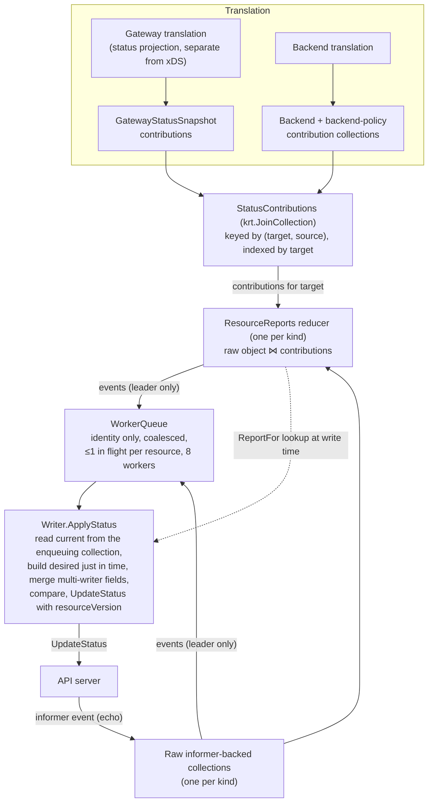

# Status Syncing in kgateway

This document describes how kgateway computes and writes Kubernetes status for
Gateways, Routes, ListenerSets, Policies, and Backends: the keyed
status-contribution pipeline, the just-in-time writers in
`pkg/pluginsdk/statussync`, the invariants the design rests on, and the seams
plugins and downstream projects use to join it.

## Motivation

The previous status syncer had two structural problems that compounded at
scale.

**Three caches that could disagree.** Translation read objects from the
Istio/KRT informer cache, but the status syncer read them back through the
controller-runtime manager cache before every write, and policies through a
third path (per-plugin kclient hooks). Skew between those caches required point
fixes — stamping `observedGeneration` from the report instead of the live
object, retrying `NotFound` on freshly created resources — and each fix
papered over the same root cause: the object used to build a status was not the
object the write raced against.

**One global value for all status.** Every Gateway translation merged its
reports into a cluster-wide `ReportMap` singleton. Any change to any producer
rebuilt and re-compared status for every Gateway, Route, Policy, ListenerSet,
and Backend in the cluster, whether or not their inputs changed. The merge
deep-cloned every route report on every translation event; at 10,000 routes
that one call path accounted for roughly half of total process allocation, and
p95 first-status staleness grew from ~1.6s at 1,000 routes to ~20s at 10,000.

The replacement keeps a single principle at every stage: **status state is
local to the object that owns it, and every read on the write path comes from
the same informer cache that triggered the write.**

## Architecture

### Contributions: keyed status facts

xDS translation is scoped to a Gateway, but Kubernetes status is owned by the
individual object. Translation therefore emits `reports.StatusContribution`
values instead of populating a shared map. A contribution is identified by:

- **Target** (`reports.StatusKey`): the status owner's *GroupKind* plus
  namespaced name. The key is deliberately version-independent — all served
  API versions of a Gateway API resource share storage and status, and the
  version a write goes through comes from the object's own `TypeMeta`, never
  from a contribution.
- **Source** (`reports.StatusSource`): a stable identity for the producing
  translation unit — the translating Gateway, or a Backend (keyed by the
  backend's full resource name, which includes the port, so two ports of one
  Service contributing to the same policy never collide).

Exactly one typed report fragment (`Gateway`, `ListenerSet`, `Route`,
`Policy`, or `Backend`) is populated per contribution. The three producer
collections — Gateway translation snapshots, backend-policy contributions, and
backend-status contributions — are joined into one `StatusContributions`
collection; their `Source.Kind` values are disjoint, so keys cannot collide
across producers.

Gateway translation exposes **separate xDS and status projections**
(`GatewayXdsResources` vs `GatewayStatusSnapshot` inside one translation
output). A status-only change updates the contribution collections without
invalidating the xDS snapshot, and vice versa.

### Reduction: one report per object

For each kind, a `ResourceReports` reducer (`statussync.RegisterKind`) joins
the raw informer-backed collection with the contributions index. Each raw
object gets one reduction containing everything currently known about it:

- Route parents and policy ancestors from multiple sources **merge** under
  their natural keys, so a route parented by two Gateways, or a policy
  attached through both the Gateway and Backend paths, reduces to one report
  without a competing singleton writer. (This also removed a race where two
  goroutines wrote competing statuses for a policy attached via both paths.)
- Gateway, ListenerSet, and Backend reports are **single-writer** owner
  snapshots. Reduction is deterministic (contributions are fully ordered by
  their identity), and a second producer for a single-writer kind logs a
  structured warning instead of silently discarding one report.
- **The reduction exists for every raw object, even when empty.** A resource
  translation stopped producing facts for keeps an empty reduction, so the
  disappearance of the last contribution is itself an observable event. This
  is what lets stale status be cleared without the synthetic "marker report"
  mechanism the old syncer needed.

Removal of one producer removes only that producer's facts; a change to one
producer recomputes only the owners it contributed to. KRT tracks the indexed
fetch, so this locality is structural, not best-effort.

### Writing: identity in the queue, everything else just in time

The write queue (`statussync.WorkQueue` / `WorkerPool`, derived from Istio's
`resourcelock.go` by way of agentgateway) stores **only object identity** —
GVK plus namespaced name. It provides:

- coalescing: duplicate pushes for a pending resource collapse;
- at most one in-flight write per resource, with a dirty bit that turns a push
  during processing into exactly one follow-up pass;
- a bounded pool (`statusSyncMaxWorkers = 8`, chosen empirically: at 5k routes
  it retained one write per route with zero conflicts across injected write
  latencies, while higher caps reintroduced intermediate writes and
  conflicts).

Because the queue holds no data, a writer always builds the **latest** desired
status when its turn comes: it reads the current object, looks up the current
reduction via `ReportFor`, builds status, merges, compares, and writes. A
burst of changes to one resource costs one write carrying the final value.

Every write goes through `UpdateStatus` carrying the `resourceVersion` the
status was built from, so stale data is rejected by the API server rather than
silently applied.

## Invariants

The pipeline's correctness rests on a small number of invariants. They are
enforced by tests, not just convention; when you add or change a writer, these
are the properties to preserve.

### 1. Writers read the collection that enqueued them

`Writer.Current` **must** read the same KRT collection whose events enqueue
the resource (`statussync.CollectionSource`). Reading through any other client
— even one over the same GVR — reintroduces a failure mode where an
independent informer's `Get` returns nil while `HasSynced` reports true,
indistinguishable at the writer from a deletion, with nothing upstream to
re-fire once that informer loads. The symptom is a resource silently carrying
no status. Sourcing reads from the enqueuing collection makes that state
unreachable; earlier iterations bounded it with a requeue mechanism
(`NotReadyRequeuer`) that this invariant made deletable.

The obligation this creates: a normalized collection feeding
`CollectionSource` must carry `ObjectMeta` (hence `resourceVersion`) and
status through faithfully, or both the no-op check and optimistic concurrency
break. See `convertTCPRouteV1ToV1Alpha2` for the reference implementation.

### 2. Desired ∘ Merge is a fixed point of its own output

Every status write echoes back as an informer event on the collection that
enqueued the resource, so the writer is always asked a second time about the
status it just wrote. The **only** thing that terminates that cycle is the
live-vs-desired equality skip, and the skip fires only when rebuilding from
what we wrote reproduces what we wrote — byte-identical, including condition
order and `LastTransitionTime`.

A builder that stamps a fresh timestamp on an unchanged condition, or that
renormalizes entries it copied from the live object, turns the designed
one-shot echo into a permanent write loop against the API server — while every
unit test of the skip mechanism keeps passing, because the skip is working and
simply never fires.

`statussync.CheckWriterIdempotent` asserts exactly this property, using the
same `decide()` path production runs. Every writer registered with the
pipeline should run it (see `TestStatusWritersAreIdempotent` and the policy
writer's harness test); downstream writers added via `WithStatusRegistration`
are expected to as well. `WriterWouldWrite` exists so a test can prove the
check is not vacuous. In practice the property holds because builders seed
conditions from the live object and apply `meta.SetStatusCondition`, which
preserves `LastTransitionTime` when nothing changed.

### 3. Multi-writer lists: own your entries, and only your entries

`RouteStatus.parents` and `PolicyStatus.ancestors` are shared with other
controllers. The rules, implemented once in `mergeOwnedStatusEntries`:

- Builders publish **only** the entries this controller owns, uncapped. The
  write path holds the only authoritative read of the live list, so the merge
  there re-derives foreign entries, replaces ours, and applies the Gateway API
  schema caps (16 ancestors, 32 parents) exactly once — truncating our entries
  before anyone else's.
- The published order is canonical (`ParentString` order, the same key Istio
  and kgateway's own builders use). Write suppression is a plain equality
  check, so an arbitrary order would disagree with any peer that publishes
  sorted, and the two controllers would rewrite the list back and forth
  forever.
- Publishing an **empty** desired list means "clear the entries I own." That
  is only worth a write when there is something of ours to retract:
  `OwnsAnyRouteParent` / `OwnsAnyPolicyAncestor` gate the empty-status path,
  because the reducer holds an entry for *every* raw object in the watched
  namespaces — most of which kgateway has never touched — and without the
  gate every one of them would receive a spurious write on each leadership
  acquisition.

`Gateway.status.addresses` is the third multi-writer field, owned by the
deployer. The Gateway writer carries the live addresses through **verbatim
and unreordered**: the deployer compares order-sensitively against a
source-ordered list, so any normalization here makes the two controllers
flip-flop the field forever.

### 4. A nil build with a report in hand is a bug, not an erase

If a route has a report but `BuildRouteStatus` returns nil, the only possible
cause is a Go type the builder's switch does not handle. The writer logs an
error and suppresses the write rather than publishing an empty status — which
the merge would apply as "clear every parent we own." A missing type-switch
case must never erase good status. (This rule exists because exactly that bug
shipped for v1alpha3 TLSRoutes during development.)

## Leadership and lifecycle

`StatusSyncer` is still a leader-elected runnable, but leadership gates only
the **write queue**:

- Contribution and reduction collections are computed on every replica, so a
  new leader starts with warm state.
- On leadership acquisition, `StatusCollections.SetQueue` attaches handlers
  for every registered source; KRT registration replays current objects as Add
  events, which is the startup sweep — every resource gets one reconciliation
  pass, and the equality skip suppresses the writes that would be no-ops.
- On leadership loss, `UnsetQueue` detaches all handlers.

The cache-sync barrier is centralized: `statussync.RegisterResourceReports`
is the only way to register a reducer, and doing so automatically enrolls its
`HasSynced` in `StatusCollections.HasSynced`. The barrier re-reads the
registration set on every call, so reducers registered later (policy plugins,
downstream registrations) are covered without a second wiring step. The sweep
therefore never writes a status built from a reducer that has not observed its
contributions.

Registration itself is deliberately hard to get wrong: `RegisterKind` wires
the reducer, the raw-object event source, and the sync barrier in one call,
because the three-call version compiled fine with any one of them missing and
each omission was a silent status outage.

## Failure handling

Failures divide into two classes with opposite treatments:

**Self-healing via informer events (no retry bookkeeping).** Conflicts and
`NotFound` are swallowed. A conflict means the API server holds a newer
`resourceVersion`; delivering that object is itself the event that re-enqueues
the resource, and the next pass builds against the fresh read. This is why
dropping `resourceVersion` from the queue key was a fix, not a simplification:
identity-keyed coalescing is what makes the conflict → informer → re-enqueue
loop converge instead of churn.

**Bounded retry for transient errors (nothing will re-fire).** After a failed
write nothing changes on the informer, so no event is guaranteed to re-enqueue
the resource. Throttling, 5xx, and network errors are therefore retried in
place (`RetryStatusWrite`: 5 attempts, exponential backoff from 100ms,
context-aware). Custom `ResourceStatusSyncer` implementations must wrap their
writes in it for the same reason — the ListenerSet syncer does.

Metrics semantics follow the same line:
`EndResourceStatusSyncOnWriteSuccess` closes a resource's sync when **no retry
is pending**, not when a status was persisted. A conflict ends the sync
without writing (the informer delivery starts a fresh one); a write that
failed every retry keeps the sync open, so the resources-out-of-sync signal
keeps telling the truth. Condition-derived error metrics are computed only
from entries this controller owns — another controller's `Accepted=False` on a
shared list must not flip our error counters.

## Route API versions

TCP and TLS routes are normalized to one Go type (`gwv1a2.*`), but the API
version an object was **served** as is the version its status must be written
back through. The conversions preserve that fact in `TypeMeta` (typed
informers deliver empty `TypeMeta`; directly-served v1alpha2 objects fall back
to the v1alpha2 GVK), the status collections key enqueued resources by the
object's own GVK, and dispatch to the per-version writer is a map lookup.
Earlier designs recovered the version by probing informers at write time; the
current design makes it a property of the object, so adding a version means
adding it to the version list and the writer switch, with no probe to keep in
sync.

One resolution per kind (`resolveRouteVersions` → `selectRouteGVRs`) drives
both the collections and the status writers, so a version we watch is always
one we can write and vice versa — the watch/write divergence in this area has
shipped as bugs more than once.

Resolution reads the served versions through **two independent readers**
(`routeVersionSource`): the CRD's `spec.versions` when `get` on
`customresourcedefinitions` is permitted, and the discovery API otherwise —
discovery needs only `system:discovery`, which every authenticated client has,
so it is the reader that survives an RBAC gap on CRDs. A confirmed-absent CRD
is an answer (nothing served), not a failure; a partial discovery answer is
rejected, because one unreadable candidate would look unserved and narrow us
away from the version the cluster actually uses. The startup resolution gets a
bounded retry since it cannot be revised later.

When either reader answers, the selection narrows to the single most-preferred
served version — including on clusters serving several versions at once, the
normal state after installing a newer Gateway API bundle over an older one:
served versions are views over shared storage, so one informer and one writer
cover every object. Only when **neither** reader can answer do all enabled
versions stay candidates, and then the critical rule applies: **an informer is
never started on an unverified version.** An informer on an unserved version
can only 404 its initial list, never syncs, and its `HasSynced` propagates
through `RoutesIndex` and `CommonCollections` into the proxy and status
syncers' untimed cache barriers — one bad guess would hang the entire control
plane. Instead, each candidate's informer is gated (`routeInformerGate`) on
being the preferred served version at gate time, so at most one runs per kind;
the rest park behind a poll loop that reports `HasSynced` (a parked informer
has nothing to sync, and holding the global barrier on a kind that may never
arrive is the unrecoverable outcome). A kind installed after startup — at
whatever version the cluster serves — is picked up by the poll without a
restart. If both readers are permanently denied, the kind goes unreconciled,
logged once per unresolved spell and retried for the life of the process: a
late kind is recoverable, a hung cache barrier is not.

## Extension points

**Policy plugins** implement `PolicyPlugin.RegisterPolicyStatus`. For a CRD
with a standard `gwv1.PolicyStatus` built by the standard builder, use
`pluginutils.RegisterPolicyStatus`. A plugin with its own desired-status
builder uses `RegisterPolicyStatusWithBuilder` and states **explicitly**
whether its conditions use the standard Valid/Pending vocabulary
(`StandardConditionErrorMetric`) or its own (`NoConditionErrorMetric` — e.g.
BackendTLSPolicy, whose Gateway API `PolicyReasonAccepted` would grade as
permanently failing under the standard rubric). The two questions are
independent, which is why they are separate parameters rather than inferred
from each other.

**Downstream resource types** use
`proxy_syncer.WithStatusRegistration(func(statussync.RegistrationInputs))`.
The inputs expose the contribution collection and index, the
`StatusCollections` to register with, and a `RegisterWriter` hook; the
registration builds its reducer with `RegisterKind` (or
`RegisterKindByObjectGVK` for normalized collections whose objects carry
distinct source GVKs) and its writer with the `statussync.Writer` primitives.
This replaces the removed `WithCustomStatusSync` whole-`ReportMap` callback.
Both entry points receive the same `RegistrationInputs` struct on purpose —
they were once field-for-field duplicate types, and a field added to one
silently did not reach the other.

A downstream writer inherits every invariant in this document, most
importantly #1 (read from the enqueuing collection) and #2 (run
`CheckWriterIdempotent` in your tests).

## Performance characteristics

Measured with the A/B scale harness at 1k/5k/10k routes against `main`
(details in the PR):

- Total measured CPU ~0.42–0.44x; total allocation ~0.32–0.39x. The dominant
  win is deleting the per-merge deep clone of every route report
  (`cloneRouteReport`), which was ~46% of main's total allocation at 10k
  routes.
- Peak RSS grows ~3.2x from 1k→10k routes versus ~14x on main (614 MiB vs
  3.12 GiB at 10k).
- p95 first-status staleness stays near-flat (~1.1s at 10k routes) where main
  degraded to ~20s.
- Route write amplification is 1.00 per route at every scale; steady-state
  churn writes exactly match the required count.
- Post-GC live heap is neutral — the win is allocation pressure and peak
  footprint, not steady-state heap.

**Known trade-off:** Gateway status writes during *initial convergence* are
higher than main (bounded burst, not steady-state churn), because
`AttachedRoutes` legitimately changes as routes arrive and the per-resource
model writes those intermediate values where the old sweep batched them.
Decoupling `AttachedRoutes` from Gateway translation so route churn updates a
small counting collection instead of the Gateway report is the tracked
follow-up.

## Design decisions and rejected alternatives

- **Why contributions instead of a smaller shared map?** Any shared aggregate
  makes every producer a dependency of every consumer. Keying by
  (target, source) gives KRT the information to invalidate precisely, and
  gives multi-producer merges (route parents, policy ancestors) natural keys
  instead of a coordination protocol.
- **Why build status at write time instead of queueing it?** Queued statuses
  go stale; a queue of identities cannot. Coalescing then falls out of the
  identity key, and retries rebuild from fresh state for free.
- **Why not retry conflicts?** The informer delivery of the winning object is
  a strictly better retry trigger than a timer: it carries the data the next
  attempt needs and it fires exactly when that data exists.
- **Why is the sort in `ReduceStatusContributions` in place?** The production
  caller passes a `krt.Fetch` result, which is freshly allocated per call.
  That is a coupling to krt internals, so it is pinned by
  `TestFetchedContributionsAreNotAliasedByIndexStorage`: an upstream krt bump
  that started returning index-owned storage fails that test loudly instead of
  silently corrupting index state.
- **Why does the write path own the schema caps?** Two caps in two packages
  had to agree on ownership policy and once disagreed, letting the first cap
  decide which of our entries survived. Only the write path holds an
  authoritative read of the live list, so the cap runs there, once.